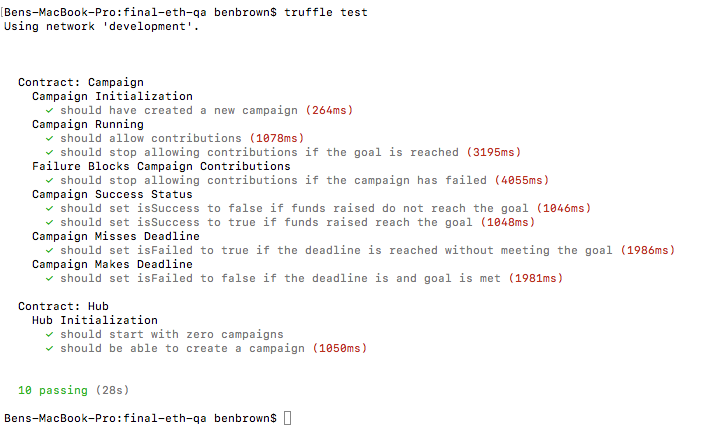

# Ethereum QA Course Final

## Part 1 - Test Plan

The location of my Test Plan is the Trello board located here:

https://trello.com/b/dSXl0Snj

---

## Part 2 - Solidity Contract Testing

### A. Manual Exploration

> Please do a thorough manual exploratory test and report any bugs that you find. Bug reports can be written in any format you like (Markdown or spreadsheet preferred) and each bug should contain a severity level 1-5, where 1 is the most severe, and a full description of the defect and how to replicate it.

#### Redundant contributions - 1 Severe

In the function `contribute()` on lines 69 and 71 we add to the `amoundContributed` for a funder. However, outside of those if conditionals we also add to the amountContributed again on line 76. 

This would lead the `funderStruct[msg.sender]` doubly increasing the amountContributed while only singly increasing the contract's `fundsRaised` on every contributuion. So an attacker could then request a refund which is 2x what they put into the contract. 

This would only be a risk if the funding failed for a contract.

#### Re-entrancy Vulnerability - 1

A contract can be called repeatedly before initial function invocations can be completes. This enables malicious parties to drain funds rapidly from smart contract implementations. It is known as the [re-entrancy race condition](https://consensys.github.io/smart-contract-best-practices/known_attacks/#reentrancy). This occurs at:

`Campaign.sol`

* Line 96-111 - `requestRefund()` including the `msg.sender.transfer()` inside this function may cause an issue when the call is consistently called and fails (in the case where people may be mass refunding from a campaign in a 'bank run')

`Hub.sol`

* Line 39 - `Hub.sol` is calling a potentially 'untrusted' contract - meaning that we can have exposed re-entrancy attacks in `Campaign.sol` to `Hub.sol` when it is calling functions in `Campaign.sol`

##### Recommendation

It is recommended to not make external calls until all internal (this contract only) work is done first. In every case, it is also recommended to use `send()` instead of `call.value()`, which will prevent code from external contracts from being called.

For `requestRefund()` it would be best to create arefunds mapping to store who is due a refund, then have a separate `withdrawRefund()` function. This follows the "push over push" security recommendations of ConsenSys.

---

#### No Fallback Function for Payables - 3

If you want your contract to receive and manage funds it should handle all situations - including instances where users send or transfer funds to non-existent functions) - not having payable fallback functions means that any transaction will be reverted. This issue occurs in both `Hub.sol` and `Campaign.sol`. Since `Owned.sol` and `Stoppable.sol` are utility contractsc, we will ignore lack of fallback payables here.

##### Recommendation

Always have a payable fallback function in any smart contract so that tokens can not be permanently lost or unexpected smart contract reversions.

---

#### Overflow/Underflow issues -  2

There are a few places where raw math operations are used. This can lead to critical [underflow and overflow issues](https://consensys.github.io/smart-contract-best-practices/known_attacks/#integer-overflow-and-underflow). This issue occurs in the following lines:

Campaign.sol

* Line 37
* Line 90-91 - 
* Line 69
* Line 75
* Line 76
* Line 105

##### Recommendation

It is recommended to replace these raw math operations with the [SafeMath Library](https://github.com/OpenZeppelin/openzeppelin-solidity/blob/master/contracts/math/SafeMath.sol)

---

#### Block Timestamp

In line 37 of `Campaign.sol` block.timestamp is used. If there is less than 30 second drift in the deadline (maybe an ICO or bot is creating and contributing very quickly to campaigs) then it may be useful to add a minimum deadline time that avoids this. Fork reogranizations and the difficulty bomb may cause issues with block.timestamp used as a time estimator.

---

### B. Unit Tests

> Write between 5-10 tests for these contracts in either Solidity or Mocha

I chose to use mocha for my unit tests as I was more familiar with testing in that environment from my other dApp experiences. I also used Async/Await structures due to the ease of readability and brevity compare to promise chaining standard mocha tests.

#### Tests for Campaign

* Should create a new campaign
* Should allow for contributions
* Should stop allowing contributions if the goal is reached
* Should stop allowing contributions if campaign has failed
* Should set isSuccess false if funds raised don't reach the goal
* Should set isSuccess true if funds raised reach the goal
* Should set isFailed true if deadline is reached w/out meeting the goal
* Should set isFailed false if deadline is not reached and goal is met

#### Tests for Hub

* Should initialize with zero campaighs
* Should be able to create a new campaign

#### Results

Here is a screenshot of the results of the tests:

Here is a link to a youtube video showing the tests running with truffle + ganache:

https://www.youtube.com/watch?v=HP1O-Qit5U0

---

### C. Jenkins CI Exposure

> Run your tests in a local instance of Jenkins and upload a screenshot of the console output when the tests run

Images of the  jenkins deployment are here:

https://imgur.com/a/1iz92Gn